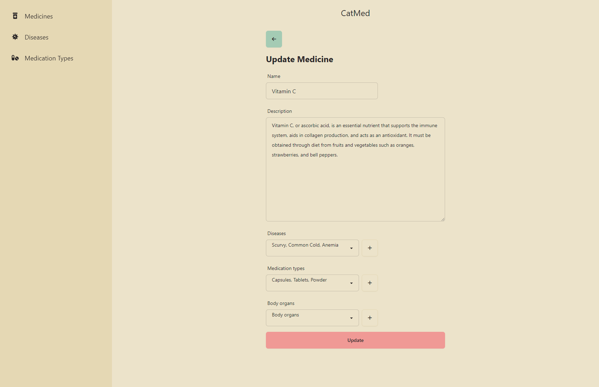
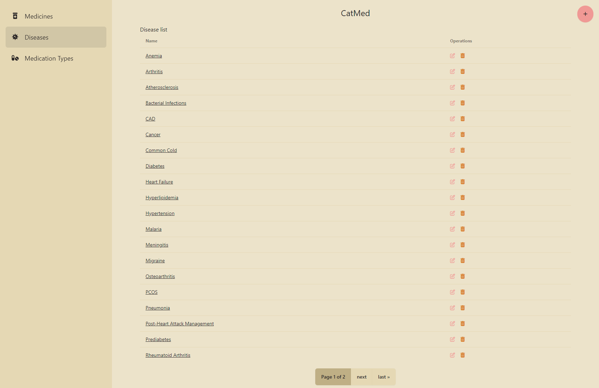

<div align="center">
  CatMed - a simple medicine datatabase
  <br />

[//]: # ([//]: # &#40;  <a href="#about"><strong>Explore the screenshots »</strong></a>&#41;)

[//]: # (  <br />)

[//]: # (  <br />)

[//]: # (  <a href="https://github.com/valeriucoding/CatMed/issues/new?assignees=&labels=bug&template=01_BUG_REPORT.md&title=bug%3A+">Report a Bug</a>)

[//]: # (  ·)

[//]: # (  <a href="https://github.com/valeriucoding/CatMed/issues/new?assignees=&labels=enhancement&template=02_FEATURE_REQUEST.md&title=feat%3A+">Request a Feature</a>)

[//]: # (  .)

[//]: # (  <a href="https://github.com/valeriucoding/CatMed/issues/new?assignees=&labels=question&template=04_SUPPORT_QUESTION.md&title=support%3A+">Ask a Question</a>)

[//]: # (</div>)

[//]: # ()

[//]: # (<div align="center">)

[//]: # (<br />)


[](https://hackclub.com)

[//]: # ([![Render]&#40;https://img.shields.io/badge/Render-46E3B7?style=for-the-badge&logo=render&logoColor=white&#41;]&#40;https://render.com&#41;)

[](https://github.com/valeriucoding)

</div>

[//]: # (<details open="open">)

[//]: # (<summary>Table of Contents</summary>)

[//]: # ()

[//]: # (- [About]&#40;#about&#41;)

[//]: # (    - [Built With]&#40;#built-with&#41;)

[//]: # (- [Getting Started]&#40;#getting-started&#41;)

[//]: # (    - [Prerequisites]&#40;#prerequisites&#41;)

[//]: # (    - [Installation]&#40;#installation&#41;)

[//]: # (- [Usage]&#40;#usage&#41;)

[//]: # (- [Acknowledgements]&#40;#acknowledgements&#41;)

[//]: # ()

[//]: # (</details>)

---

[//]: # (#### **website takes ~60 seconds to load for the first time, please be patient.**)

## About

#### Inspiration

A friend of mine who is a doctor asked me to make an app that would help him keep track of medicine using categories of
different types.
So that's how the project started.

#### What it does

This project is all about organizing information related to medicines, diseases, and the body parts they affect. You
can create medicines in the system and link them to different organs or categorize them by the types of conditions they
treat.

The idea behind this project is to make it easier to keep track of medicines and how they’re connected to different
diseases and organs.
It was created with the intention of helping doctors to quickly find the right medicine for a
specific condition.

#### Features

* Associate medicines with diseases, medication types, and organs
* Assign medicine products to a medicine and get the price and name from supported websites
  * Supported websites: [Zenyth](https://zenyth.ro), [Secom](https://secom.ro), [DrMax](https://drmax.ro)
* Basic authentication with more features coming soon

#### The goal

The goal of this project is to see it being used by my friend but also by other doctors who might find it useful.

#### Future plans

Future features include the ability to track prices more accurately and adding the ability to have private and public databases of medicines.

|                                                                                                                          |                                                                                           |
|:------------------------------------------------------------------------------------------------------------------------:|:-----------------------------------------------------------------------------------------:|
|  |  |
|                                     |        |

[//]: # (<table>)

[//]: # (  <tr>)

[//]: # ()

[//]: # (    <td></td>)

[//]: # ()

[//]: # (    <td></td>)

[//]: # ()

[//]: # (  </tr>)

[//]: # ()

[//]: # (  <tr>)

[//]: # ()

[//]: # (    <td></td>)

[//]: # ()

[//]: # (    <td></td>)

[//]: # ()

[//]: # (  </tr>)

[//]: # (</table>)

[//]: # (<details>)

[//]: # ()

[//]: # (<summary>Screenshots</summary>)

[//]: # ()

[//]: # (<br>)

[//]: # (|                                   Home Page                                    |                                    Login Page                                    |)

[//]: # (|:------------------------------------------------------------------------------:|:--------------------------------------------------------------------------------:|)

[//]: # (|    |  |)

[//]: # (|                                  Update Page                                   |                                   Disease List                                   |)

[//]: # (|  |       |)

[//]: # (</details>)

### Built With

[](https://www.djangoproject.com)

[](https://htmx.org)

[](https://tailwindcss.com)

[](https://daisyui.com)

[//]: # (![Home Page]&#40;docs/images/medicine_list.png&#41;)

[//]: # (![Medicine Detail]&#40;docs/images/medicine_detail.png&#41;)

[//]: # (![Update Page]&#40;docs/images/medicine_update.png&#41;)

[//]: # (![Disease List]&#40;docs/images/disease_list.png&#41;)

## Getting Started

### Prerequisites

To get started with the project, you'll need:

- **Python 3.10**
- **Virtual environment**

### Installation

1. Clone the repo
   ```bash
   git clone
    ```
2. Install the dependencies
   ```bash
   pip install -r requirements.txt
    ```
3. Run the migrations
    ```bash
    python manage.py migrate
     ```
4. Run the development server
   ```bash
   python manage.py runserver
    ```

## Acknowledgements

