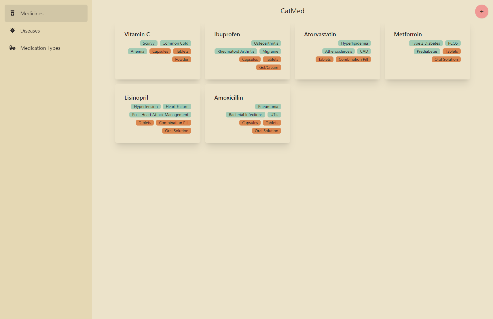
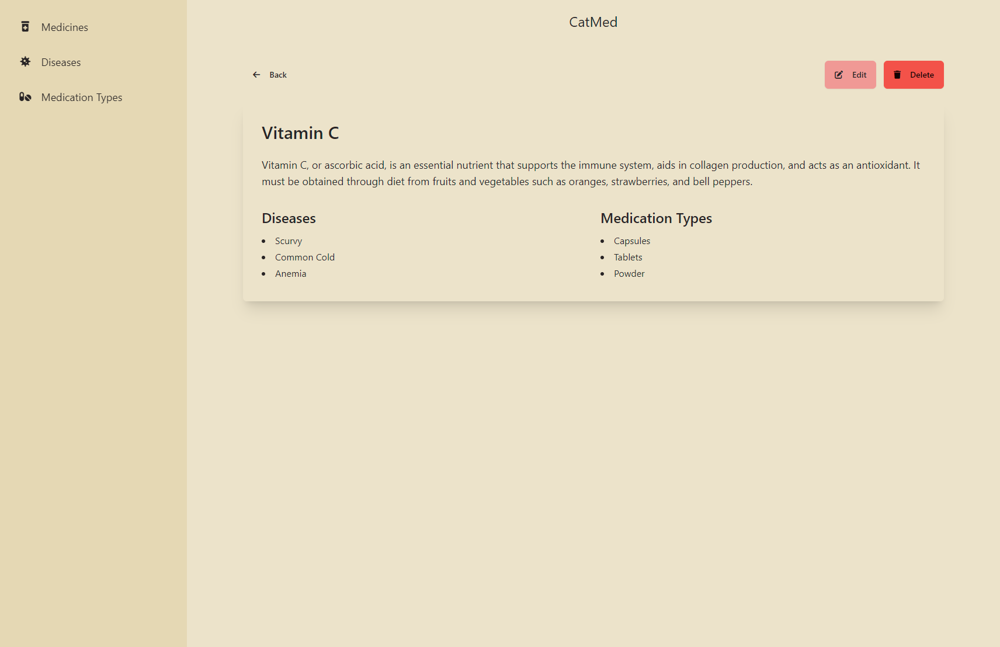

<div align="center">
  CatMed
  <br />

[//]: # ([//]: # &#40;  <a href="#about"><strong>Explore the screenshots »</strong></a>&#41;)

[//]: # (  <br />)

[//]: # (  <br />)

[//]: # (  <a href="https://github.com/valeriucoding/CatMed/issues/new?assignees=&labels=bug&template=01_BUG_REPORT.md&title=bug%3A+">Report a Bug</a>)

[//]: # (  ·)

[//]: # (  <a href="https://github.com/valeriucoding/CatMed/issues/new?assignees=&labels=enhancement&template=02_FEATURE_REQUEST.md&title=feat%3A+">Request a Feature</a>)

[//]: # (  .)

[//]: # (  <a href="https://github.com/valeriucoding/CatMed/issues/new?assignees=&labels=question&template=04_SUPPORT_QUESTION.md&title=support%3A+">Ask a Question</a>)

[//]: # (</div>)

[//]: # ()

[//]: # (<div align="center">)

[//]: # (<br />)


[](https://hackclub.com)

[//]: # ([![Render]&#40;https://img.shields.io/badge/Render-46E3B7?style=for-the-badge&logo=render&logoColor=white&#41;]&#40;https://render.com&#41;)

[](LICENSE)

[](https://github.com/valeriucoding/CatMed/issues?q=is%3Aissue+is%3Aopen+label%3A%22help+wanted%22)
[](https://github.com/valeriucoding)

</div>

<details open="open">
<summary>Table of Contents</summary>

- [About](#about)
    - [Built With](#built-with)
- [Getting Started](#getting-started)
    - [Prerequisites](#prerequisites)
    - [Installation](#installation)
- [Usage](#usage)
- [Roadmap](#roadmap)
- [License](#license)
- [Acknowledgements](#acknowledgements)

</details>

---

## About

This project is all about organizing information related to medicines, diseases, and the body parts they affect. You
can create medicines in the system and link them to different organs or categorize them by the types of conditions they
treat.

The idea behind this project is to make it easier to keep track of medicines and how they’re connected to different
diseases and body parts.
It was created with the intention of helping doctors to quickly find the right medicine for a
specific condition.

It is part of the Hack Club Summer of Making program of 2024.

<details>
<summary>Screenshots</summary>
<br>

> **[?]**
> Please provide your screenshots here.

|                                  Home Page                                   |                                    Login Page                                    |
|:----------------------------------------------------------------------------:|:--------------------------------------------------------------------------------:|
|  |  |

</details>

### Built With

* [](https://www.djangoproject.com)
* [](https://htmx.org)
* [](https://tailwindcss.com)
* [](https://daisyui.com)

## Getting Started

### Prerequisites

To get started with the project, you'll need:

- **Python 3.10**
- **Virtual environment**

### Installation

1. Clone the repo
   ```bash
   git clone
    ```
2. Install the dependencies
   ```bash
   pip install -r requirements.txt
    ```
3. Run the migrations
    ```bash
    python manage.py migrate
     ```
4. Run the development server
   ```bash
   python manage.py runserver
    ```

## Roadmap

See the [open issues](https://github.com/valeriucoding/CatMed/issues) for a list of proposed features (and known
issues).

- [Top Feature Requests](https://github.com/valeriucoding/CatMed/issues?q=label%3Aenhancement+is%3Aopen+sort%3Areactions-%2B1-desc) (
  Add your votes using the 👍 reaction)
- [Top Bugs](https://github.com/valeriucoding/CatMed/issues?q=is%3Aissue+is%3Aopen+label%3Abug+sort%3Areactions-%2B1-desc) (
  Add your votes using the 👍 reaction)
- [Newest Bugs](https://github.com/valeriucoding/CatMed/issues?q=is%3Aopen+is%3Aissue+label%3Abug)

Reach out to the maintainer at one of the following places:

- [GitHub issues](https://github.com/valeriucoding/CatMed/issues/new?assignees=&labels=question&template=04_SUPPORT_QUESTION.md&title=support%3A+)
- Contact options listed on [this GitHub profile](https://github.com/valeriucoding)

## License

This project is licensed under the **MIT license**.

See [LICENSE](LICENSE) for more information.

## Acknowledgements

> I want to thank Hack Club for motivating me to work on this project every day during summer.
